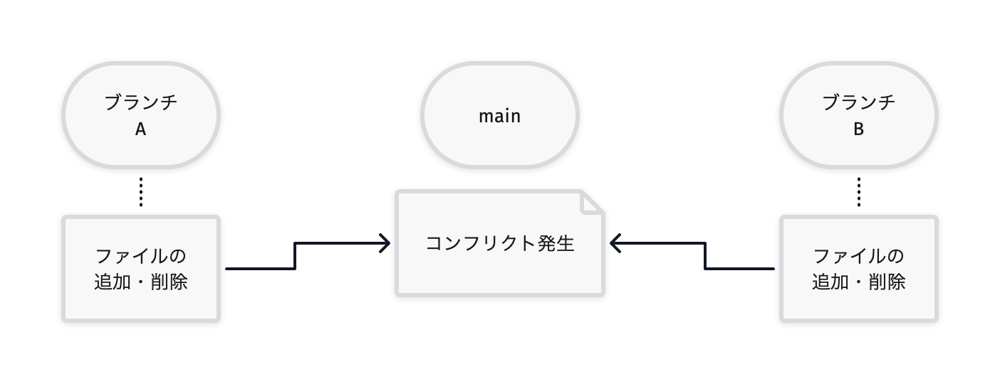
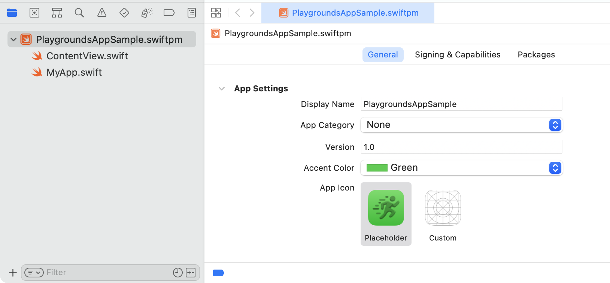
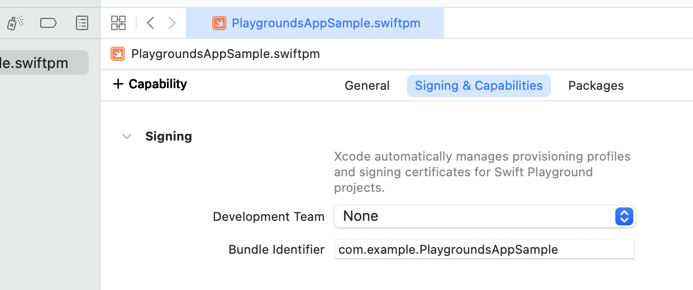
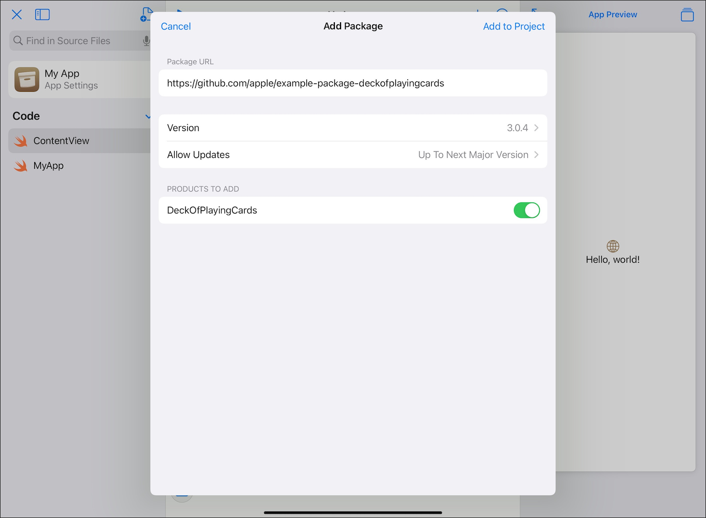

<!--
title:   Swift Playgrounds App
tags:    Swift,SwiftPM,Xcode,iOS
id:      cf77148d7508fb0ca93c
private: true
-->
2021年から、iPadのSwift Playgroundsアプリを使ってiOSアプリの開発ができるようになりました。この際、従来のやり方であるXcodeを使ったiOSアプリの開発とは異なる、新しいプロジェクト形式が使われます。

この新しいプロジェクト形式は、従来の形式にあった問題点を解消していて興味深いです。本記事では、この新しいプロジェクト形式がどのようなものなのか見ていきます。

## Xcodeプロジェクト形式

まず、従来のプロジェクト形式について確認しましょう。ここでは、「Xcodeプロジェクト形式」と呼ぶことにします。

XcodeでiOS Appを新規作成すると、`.xcodeproj` という拡張子のバンドル（フォルダ）ができます。xcodeprojバンドルの中に `project.pbxproj` というファイルがあり、これにプロジェクトの情報が保存されます。

```shellsession title="Xcodeプロジェクト形式の構成ファイル（一部省略）"
XcodeAppSample/
├── XcodeAppSample/
│   ├── ContentView.swift
│   └── MyApp.swift
└── XcodeAppSample.xcodeproj/
    ├── project.pbxproj
    ├── project.xcworkspace/
    │   ├── contents.xcworkspacedata
    │   └── xcuserdata/
    └── xcuserdata/
```

Xcodeでプロジェクトに関する変更を行うと、`project.pbxproj` ファイルが更新されます。このファイル自体はプレーンテキストファイルであるため、内容をテキストエディタなどで開いて読めます。ただし、Xcodeがこのファイルをどのような内容で作成し更新するのかの規則は公開されていません。

### Xcodeのプロジェクト形式の問題点

XcodeプロジェクトをGit（あるいは他のバージョン管理ツール）で扱う場合、通常は `project.pbxproj` ファイルをリポジトリに含めます。しかしこの方法は、コンフリクトの原因になりやすいです。

とくに、Xcodeプロジェクトに対してファイルを追加したり削除したりする場合にも `project.pbxproj` ファイルが更新されます。そのため、異なる開発ブランチでファイルの追加や削除があった場合にそれぞれの変更がコンフリクトを起こしやすく、手作業でマージする必要が出てきます。これは面倒ですし間違いやすいです。



この問題を回避する手段としては、`project.pbxproj` ファイルを生成するツールを使う方法が挙げられます。たとえば、XcodeGen<span class="footnote">https://github.com/yonaskolb/XcodeGen</span>はYAMLファイルから、Tuist<span class="footnote">https://tuist.io/</span>はSwiftファイルから、`project.pbxproj` ファイルを生成します。これらを使うことで `project.pbxproj` ファイルを直接Gitで管理せずにすみます。

別の回避手段として、Swiftパッケージを利用する方法があります。Swiftソースコードを直接Xcodeプロジェクトの管理下には入れずに、Swiftパッケージで管理するようにします。こうすることで、単なるファイルの追加や削除では `project.pbxproj` ファイルが更新されないため、コンフリクトが起こりにくくなります。

こうした回避手段はあるものの、Xcodeプロジェクト形式はGitで扱う場合に注意が必要になってきます。

## Swift Playgrounds App形式

それでは次に、新しいプロジェクト形式について見ていきましょう。ここでは、「Swift Playgrounds App形式」と呼ぶことにします。

Swift Playgroundsアプリ<span class="footnote">https://www.apple.com/jp/swift/playgrounds/ iPad版とMac版があります。</span>のバージョン4以降でAppが作成できるようになりました。これを使ってAppを新規作成すると、Swift Playgrounds App形式でプロジェクトが作成されます。

実はXcodeでも、バージョン13.2以降でSwift Playgrounds Appが作成できるようになりました。XcodeでSwift Playgrounds Appを新規作成すると、Xcodeプロジェクト形式ではなくSwift Playgrounds App形式でプロジェクトが作成されます。

Swift Playgrounds App形式では、`.swiftpm` という拡張子のバンドルができます。では、実際にプロジェクトを作成して、その中身を探検してみましょう。

```shellsession title="Swift Playgrounds App形式の構成ファイル"
PlaygroundsAppSample.swiftpm/
├── .swiftpm/
├── ContentView.swift
├── MyApp.swift
└── Package.swift
```

Xcodeプロジェクト形式では、Swiftソースコードのフォルダとxcodeprojバンドルとは別々になっていました。しかしSwift Playgrounds App形式では、Swiftソースコードも `PlaygroundsAppSample.swiftpm` バンドルの中に入っていることがわかります。

また、`Package.swift` ファイルがあるので、`PlaygroundsAppSample.swiftpm` バンドルの中はSwiftパッケージになっていることがわかります。

バンドルの中に、ドットから始まる名前の `.swiftpm` というフォルダがあります。この中身ものぞいてみましょう。

```shellsession title=".swiftpmフォルダの内容（一部省略）"
.swiftpm/
├── playgrounds/
│   ├── CachedManifest.plist
│   ├── DocumentThumbnail.plist
│   ├── DocumentThumbnail.png
│   └── Workspace.plist
└── xcode/
    ├── package.xcworkspace/
    │   ├── contents.xcworkspacedata
    │   └── xcuserdata/
    └── xcuserdata/
```

`playgrounds` フォルダはSwift Playgroundsアプリでプロジェクトを作成したり開いたりすると作成されます。`xcode` フォルダはXcodeでプロジェクトを作成したり開いたりすると作成されます。ファイル構成は大きく異なるものの、どちらもワークスペースの情報が入っています。

Xcodeプロジェクト形式のときの `project.pbxproj` ファイルに当たる内容がどこに行ったのかが気になるところです。実はこれは、`Package.swift` ファイルの中に入っています。このファイルの内容については後で詳しく述べます。

### Xcodeのプロジェクト形式の問題点の解消

`project.pbxproj` ファイルがなくなってSwiftパッケージの形になったことで、前述のXcodeのプロジェクト形式の問題点が解消されています。

単なるファイルの追加や削除では `Package.swift` ファイルが更新されないため、Gitでのコンフリクトが起こりにくくなります。Git（あるいは他のバージョン管理ツール）と相性が良いと言えるでしょう。

また、プロジェクトの情報が `Package.swift` ファイルの中でSwiftソースコードの形で記述されるため、内容が読みやすく明確です。変更されたときの差分も読みやすくなりそうです。

## Package.swiftの内容

では、`Package.swift` ファイルの内容を見てみましょう。

```swift title="Swift Playgrounds App形式のPackage.swiftの内容"
// swift-tools-version: 5.6

// WARNING:
// This file is automatically generated.
// Do not edit it by hand because the contents will be replaced.

import PackageDescription
import AppleProductTypes

let package = Package(
    name: "PlaygroundsAppSample",
    platforms: [
        .iOS("15.2")
    ],
    products: [
        .iOSApplication(
            name: "PlaygroundsAppSample",
            targets: ["AppModule"],
            bundleIdentifier: "com.example.Sample",
            displayVersion: "1.0",
            bundleVersion: "1",
            appIcon: .placeholder(icon: .running),
            accentColor: .presetColor(.green),
            supportedDeviceFamilies: [
                .pad,
                .phone
            ],
            supportedInterfaceOrientations: [
                .portrait,
                .landscapeRight,
                .landscapeLeft,
                .portraitUpsideDown(
                    .when(deviceFamilies: [.pad]))
            ]
        )
    ],
    targets: [
        .executableTarget(
            name: "AppModule",
            path: "."
        )
    ]
)
```

最初のほうのコメントで「WARNING: This file is automatically generated. Do not edit it by hand because the contents will be replaced.」と書かれているので、Swift PlaygroundsアプリやXcodeが生成するファイルであることがうかがえます。

また、インポートしているモジュールが `PackageDescription` だけではなく、見慣れない `AppleProductTypes` というものがあります。しかし、`AppleProductTypes` の定義やドキュメントをXcodeで簡単に見ることはできないようです。

その後 `package` が定義されているのは通常のSwiftパッケージと同様です。ただ、`products` にある `.iOSApplication` が目立ちます。通常のSwiftパッケージでは `.executable` か `.library` であるところです<span class="footnote">なお、Swift 5.6で `.plugin` が追加されています。</span>。しかし、`.iOSApplication` の定義やドキュメントをXcodeで簡単に見ることはできないようです。

こうして見ると、内容はSwiftソースコードとして読めるものの、自由に編集できるわけではないようです。また、定義が隠されていて分からないものもあります。

### Xcode上の表示

また、Swift Playgrounds AppをXcodeで開くと、次のようになります。



`Package.swift` ファイルが見えておらず、代わりにプロジェクト設定があります。このことからも、`Package.swift` ファイルは直接編集するものではなく、Swift PlaygroundsアプリやXcodeが生成するファイルであることがうかがえます。

## iOSApplicationプロダクト

`Package.swift` ファイルに記述があった `iOSApplication` は `Product` の一種ですが `PackageDescription` モジュールでは定義されていません。実は `AppleProductTypes` モジュールで定義されています。

`AppleProductTypes` モジュールはSwift PlaygroundsアプリやXcodeの中にあるようで、Xcode上では簡単に定義を調べることはできません。Xcode.appの中身をのぞいてみると、次の場所でインターフェースの定義を見つけることができます。

```shellsession title="AppleProductTypesのインターフェース"
/Applications/Xcode.app/Contents/PlugIns/
  IDESwiftPackageCore.framework/Versions/Current/Frameworks/
  SwiftPM.framework/SharedSupport/ManifestAPI/
  AppleProductTypes.swiftmodule/arm64-apple-macos.swiftinterface
```

その内容を整理すると、どうやら `iOSApplication` の定義は次のようになっています。

```swift title="iOSApplicationの定義"
public static func iOSApplication(
    name: String,
    targets: [String],
    bundleIdentifier: String? = nil,
    teamIdentifier: String? = nil,
    displayVersion: String? = nil,
    bundleVersion: String? = nil,
    appIcon: IOSAppInfo.AppIcon? = nil,
    accentColor: IOSAppInfo.AccentColor? = nil,
    supportedDeviceFamilies: [IOSAppInfo.DeviceFamily],
    supportedInterfaceOrientations:
        [IOSAppInfo.InterfaceOrientation],
    capabilities: [IOSAppInfo.Capability] = [],
    appCategory: IOSAppInfo.AppCategory? = nil,
    additionalInfoPlistContentFilePath: String? = nil
) -> Product
```

iOSアプリの各種設定がSwiftパッケージの `Product` として定義されているようです。また、Xcode上の表示とも対応しているようです。

### iOSApplicationの制限

`iOSApplication` の定義やXcodeでの設定を見ていると、Swift Playgrounds App形式はXcodeプロジェクト形式でのiOSアプリ開発と比べて、いくつか制限事項があることがわかってきます。

まず、Code SigningはAutomatically managed signingのみがサポートされています。Xcode上では「Xcode automatically manages provisioning profiles and signing certificates for Swift Playground projects.」という記述があります。この自動設定は便利な機能ではありますが、手動での設定ができないという点には注意が必要です。



また、Build Settingsの機能がありません。特にビルド設定を変えない場合は良いのですが、変更できないという点には注意が必要です。

Build Phasesの設定がなく、とくにビルドスクリプトが設定できません。これは、Swiftパッケージのプラグイン機能を使うことで解消できそうではあります。ただし、`Package.swift` はXcodeで管理されていて自由に編集できず、プラグインの設定をしても削除されてしまいます。

ユニットテストやUIテストのサポートがありません。Swiftパッケージはユニットテストをサポートしていますが、やはり `Package.swift` がXcodeで管理されていて自由に編集できないことが問題となります。

App Extensionの開発がサポートされていません。開発したい場合はXcodeプロジェクト形式を使う必要があります。

## Swift Playgrounds Appの特徴

Swift Playgrounds App形式の制限を挙げましたが、iOSアプリ開発自体は可能であり、App Storeへのリリースもサポートされています。Swift PlaygroundsアプリからApp Store Connectにつないでアプリをリリースできます。

Swift Playgroundsアプリを使わずXcodeのみで開発する場合でも、制限が問題にならない範囲であれば、Swift Playgrounds App形式を使ってiOSアプリ開発ができます。Swift Playgrounds App形式はベースがSwiftパッケージであるため、ファイルの追加や削除、サブフォルダへの分割などが容易です。この点はXcodeプロジェクト形式に比べてストレスが少ないです。

Swift PlaygroundsアプリでもXcodeでも、Swiftパッケージを追加できます。これによって外部ライブラリを利用できます。



また、Swift Playgrounds Appを新規作成するとSwiftUIベースのアプリが作成されますが、実はUIKitをインポートして利用できます。そのため、必ずしもSwiftUIで画面作成をする必要はなく、UIKitで画面作成をしても問題ありません。ただし、Storyboardはサポートされないようです。

## まとめ

Swift Playgrounds App形式はSwiftパッケージをベースにしたプロジェクト形式です。従来のXcodeプロジェクト形式に比べて制限が多く、まだ従来のXcodeプロジェクトを置き換えるのは難しそうです。ただ、制限が問題にならない範囲ではiOSアプリ開発が可能です。良い点もあるので、今後の発展に期待したいところです。