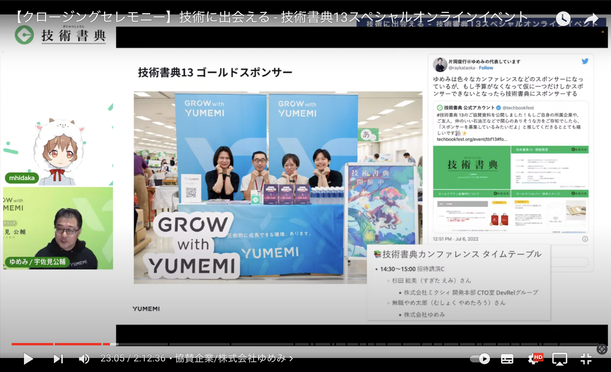
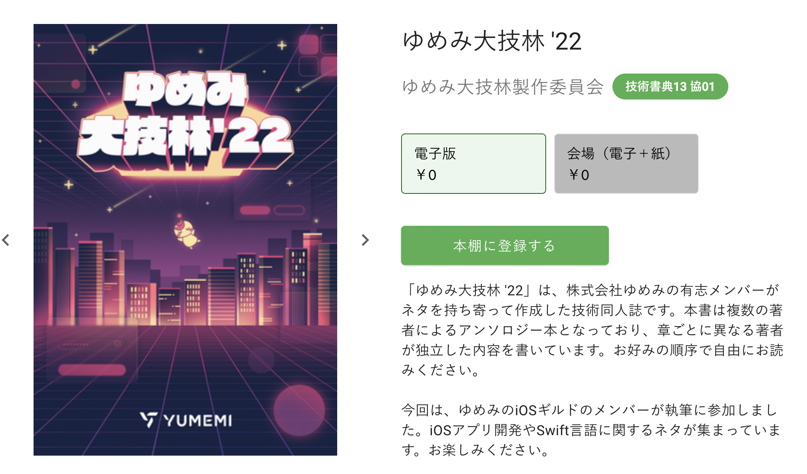

<!--
title:   「ゆめみ大技林 '22」ができるまで
tags:    Swift,iOS,ゆめみ,技術書,技術書典
id:      131e22d355cda4563e3e
private: false
-->
今年9月に開催された[技術書典13](https://techbookfest.org/event/tbf13)で、ゆめみの有志メンバーで「[ゆめみ大技林 '22](https://techbookfest.org/product/9g7iLPz8dzmL2QrrbedbxG)」を出展しました。どのように取り組んだのかを改めて振り返ってみます。

なお、「ゆめみ大技林 '22」は電子版と紙書籍版を無料で配布しました。電子版は現在も引き続き無料で配布しておりますので、ぜひご覧ください。

# 技術同人誌と技術書典

同人誌のなかでもとくに技術に特化した、技術同人誌と呼ばれるジャンルがあります。このジャンルが確立されたのは、2016年に始まった[技術書典](https://techbookfest.org)からです。技術書典以前にも技術系の同人誌はありましたが、技術同人誌に特化した同人誌即売会である技術書典の開催によってメジャーになりました。

技術書典の「よくある質問」ページの項目「[技術書とはなんですか？](https://techbookfest.zendesk.com/hc/ja/articles/360051698491)」によると、「技術書」とは「ITや機械工作とその周辺領域について書いた本」を指します。これは対象が広い定義で、プログラミングの技術だけでなくさまざまな技術同人誌が実際に配布されています。

ゆめみは何度か技術書典のスポンサーをしています。技術書典13のオンラインイベントでは、[協賛企業ゲストトーク](https://www.youtube.com/watch?v=Omd4jOscXK8&t=1280s)に僕が登壇してゆめみの紹介をしました。

# プロリク

技術書典12まで、ゆめみはスポンサーをしているものの技術同人誌は出展していませんでした。僕は2022年の1月に入社しましたが、ゆめみがもともとアウトプットに力を入れていることもあり、ゆめみ発の技術同人誌を作成してみたいと思っていました。

僕は個人的な活動として[技術書をいくつか書いています](https://usami-k.github.io/techbook/)。技術書を書くのは労力がかかりますが、やってやれないことでもありません。

とくに、一冊を一人で作るのではなく複数の人が独立した記事を書くアンソロジー本の形式なら、参加者をうまく集められれば実現できます。もちろん、参加者を集めることは大変です。しかし、ゆめみのメンバーなら何とかなるだろうと感じて、まずは試験的に取り組みを始めてみることにしました。

ゆめみには[プロリク](https://notion.yumemi.co.jp/cxo/ceo)（プロポーザルレビューリクエスト）という制度があり、メンバー誰もが意思決定ができます。そこで、「技術書執筆ワーキンググループを試験的に発足する」というプロリクを出しました。

プロリクを出して意思決定したら、遂行責任があります。技術書執筆WGを実際に発足して、そのなかのプロジェクトとして技術書典13に向けて技術同人誌を作る活動を進めました。

# 企画検討

最初からゆめみのエンジニアのすべてのギルドを巻き込むのは大変そうだと思い、僕が属しているiOSギルドのメンバーに声をかけて進めていきました（次回以降はiOSギルド以外も巻き込みたいと考えています）。

iOSギルドで毎週行われている社内勉強会の時間を借りて、ネタ出し会を実施しました。Zoomでワイワイ話しながら、アンソロジー本に含める記事のネタをNotionに書いていくという会です。この時点では、誰が執筆に参加するかやどのネタを執筆するかは気にせず、ネタを出していきました。この会のおかげで、執筆参加のハードルが少し下がったのではないかと思います。

執筆に参加してくれる人や制作に協力してくれる人が出てきたあたりで、本の体裁やタイトルをみんなで考えました。その結果として出てきたタイトルが「ゆめみ大技林 '22」です。サークル名も自然に「ゆめみ大技林製作委員会」で決まり、技術書典13へのサークル参加申し込みを行いました。

# 組版環境

実際の執筆にあたり、紙面をレイアウトして実際に組み立てる組版作業について考える必要があります。組版は手作業で行うこともありますが、ツールを使って機械的に配布データを生成する組版環境を作ることにしました。そうすることで、将来また本を制作する際に組版環境を再利用できます。

組版ができるツールは、プレーンテキストから機械的に配布データを生成できるものに限っても、いろいろあります。僕の個人的な活動では[Re:VIEW](https://reviewml.org/ja/)を使うことが多いです。

今回のツール選定では、各執筆者に記事をMarkdown形式で書いてもらえることを重視しました。現在、プレーンテキストで技術記事を書く場合はMarkdown形式が広く使われており、慣れた形式で書いてもらいたいです。そこで、以前から気になっていた[Vivliostyle](https://vivliostyle.org/ja/)を採用しました。

Vivliostyleの環境を作る際に悩んだのが、ベースとなるNode.jsの環境をどう整えるかでした。せっかくなので各執筆者の手元で組版ができるようにしたいのですが、iOSアプリエンジニアにとって、Node.js環境はさほど馴染みがあるものではありません。今回は[Volta](https://volta.sh)を採用してみました。個人的には良いと思ったのですが、振り返ると、ここはDocker環境を整えるべきだったと思います。次回までに改善したいところです。

また、Vivliostyle自体の経験が少なかったのも悩むポイントでした。この点では、ゆめみの同僚がとても頑張ってくれました。その内容が以下の記事になっていますので、こちらもぜひご覧ください。

* [Vivliostyleの公式テーマをカスタマイズして、ゆめみ大技林 '22のテーマを作った](https://zenn.dev/macneko/articles/06aec138a357b9)

# 表紙

本を作るにあたって欠かせないのが表紙です。これについては、ゆめみのデザイナーさんが快く引き受けてくださり、とても助かりました。

どんなデザインがいいか考えて依頼するのは難しいのですが、ふんわりした要求からスッといい感じの表紙を作成していただきました。デザイナーさんってすごい。

表紙を依頼した時点では、まだ全体のページ数が決まっていませんでした。ページ数が決まっていないと背表紙の幅が決まらず、印刷所に渡すデータが確定しません。

全体のページ数を決めるのは悩みました。これは本を作るうえで意外と難しいポイントです。多めに見積もっておいて、余白ページができたら埋める方法をあとで考えよう、という方針でページ数を確定させました。その後、実際にできあがってみるとちょうどくらいのページ数になり、微調整でいい感じに収まりました。

# 印刷と配布

紙の本を出すならば、印刷と配布を考える必要があります。

印刷については、僕以外にもメンバーに経験者がいて、とても助かりました。最終的に、技術書典13のバックアップ印刷所のひとつである[日光企画](https://www.nikko-pc.com/index/top.html)さんに依頼しました。

印刷所への入稿締め切りを意識しつつスケジュールを組みましたが、実際にはわりとギリギリまで執筆と組版を行なっていました。これはこれで、みんなでワイワイやってる感があって楽しめました。ただまあ、スケジュールにもう少し余裕が持てると良いですね。

印刷代は、会社のiOS委員会の活動経費として出してもらいます。そこで、いっそ紙書籍を無料で配布してしまおうという話になりました。執筆者への報酬がなくなりますが、それよりもお金の勘定が楽になるほうがいい、という動機です。今後もこの方針を継続するかは不明です。

ゆめみはスポンサーブースを出すことができるため、そのブースを利用してゆめみ大技林を配布することにしました。結果的に、とてもいいポジションのブースで多くの方に配布できて良かったです。また、同時に技術書典オンラインマーケットで電子版を無料で配布しました。こちらも多くの方にダウンロードいただけて良かったです。

# おわりに

「ゆめみ大技林 '22」の制作過程を振り返ってみました。来年は「ゆめみ大技林 '23（仮称）」の制作に取り組んでいきたいと思います。